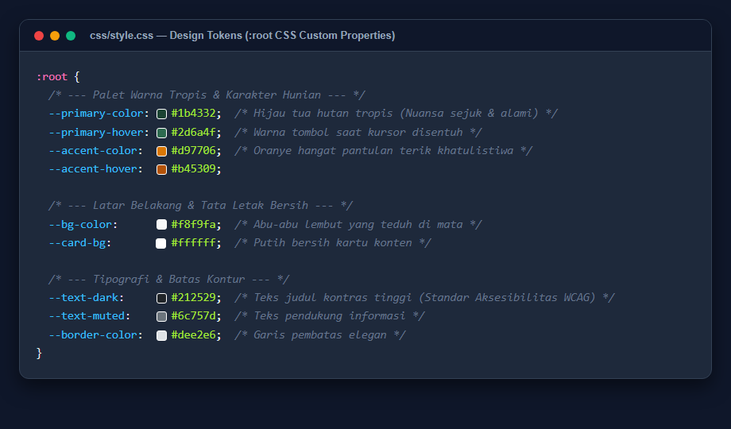
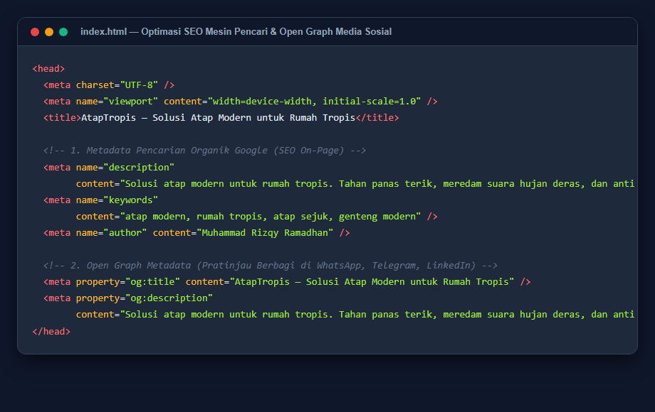
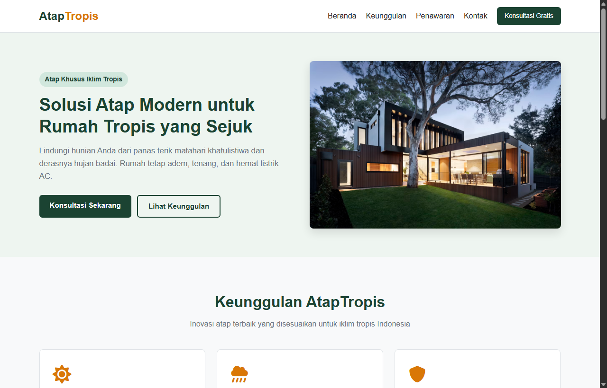
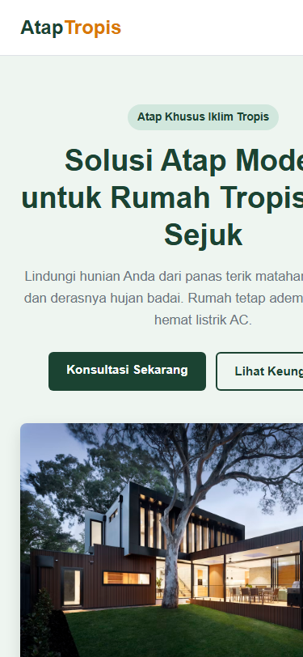

# SECTION E — LAPORAN DOKUMENTASI PROYEK
## Solusi Atap Modern untuk Rumah Tropis (AtapTropis)

**Nama Pengembang:** Muhammad Rizqy Ramadhan  
**Repositori GitHub:** [https://github.com/rizqy281100/Section-D](https://github.com/rizqy281100/Section-D)  
**Kategori Tugas:** Section D & E — Practical Web Task & Documentation  
**Waktu Penyusunan:** September 2026  

---

## DAFTAR ISI
1. [BAB 1: Penjelasan Struktur Project](#bab-1-penjelasan-struktur-project)
2. [BAB 2: Pendekatan Technical yang Digunakan](#bab-2-pendekatan-technical-yang-digunakan)
3. [BAB 3: Kendala yang Ditemukan & Solusinya](#bab-3-kendala-yang-ditemukan--solusinya)
4. [BAB 4: Rencana Peningkatan Jangka Panjang](#bab-4-rencana-peningkatan-jangka-panjang)
5. [BAB 5: Lampiran Screenshot & Pratinjau Desain](#bab-5-lampiran-screenshot--pratinjau-desain)

---

## BAB 1: Penjelasan Struktur Project

Struktur proyek dirancang dengan prinsip **Clean Code, Rapi, dan Ramah Pemula**. Setiap berkas diletakkan secara terpisah sesuai fungsinya (separation of concerns), sehingga siapa pun yang baru belajar coding dapat dengan mudah membaca alur kodenya tanpa kebingungan.

### 1.1 Susunan Direktori & Berkas

```text
SECTION D - PRACTICAL WEB TASK/
│
├── index.html          # Halaman utama landing page (Struktur konten)
│
├── css/
│   └── style.css       # Lembar gaya tampilan (Desain, warna, & responsivitas)
│
├── js/
│   └── script.js       # Logika interaktif (Menu mobile & tombol form)
│
├── docs/
│   └── screenshots/    # Dokumentasi visual dan tangkapan layar
│       ├── design_tokens.png
│       ├── seo_tags.png
│       ├── hero_desktop.png
│       └── hero_mobile.png
│
├── README.md           # Ringkasan proyek & badge tools
└── DOCUMENTATION.md    # Dokumen laporan teknis lengkap (Section E)
```

### 1.2 Penjelasan Peran Masing-Masing Berkas (Analogi Awam)

Untuk mempermudah pemahaman orang awam, pembuatan website ini dapat diibaratkan seperti **membangun sebuah rumah**:

1. **`index.html` (Kerangka & Dinding Bangunan)**  
   HTML berfungsi menyusun kerangka dasar: menentukan di mana ruang tamu (Hero Section), ruang etalase (Product Benefits), spanduk penawaran (CTA Section), hingga meja resepsionis penerima tamu (Contact Form). Berkas ini memastikan seluruh informasi tersusun logis dan dapat dibaca oleh manusia maupun mesin pencari Google.
2. **`css/style.css` (Cat, Dekorasi & Arsitektur Bangunan)**  
   CSS bertugas memberikan sentuhan keindahan. CSS menentukan warna dinding (hijau tua tropis dan emas hangat), kerapian tata letak kartu, jarak antar-ruangan, hingga memastikan bentuk bangunan dapat menyesuaikan diri secara otomatis saat dilihat dari layar komputer besar maupun layar ponsel kecil.
3. **`js/script.js` (Sistem Kelistrikan & Engsel Pintu)**  
   JavaScript memberikan daya interaksi. Jika tombol menu ditekan, pintu navigasi terbuka; jika pengunjung menekan tombol kirim pada formulir, sistem akan memunculkan pemberitahuan ramah bahwa pesan telah diterima, lalu merapikan kembali meja formulir.

---

## BAB 2: Pendekatan Technical yang Digunakan

Proyek ini sengaja dibangun menggunakan teknologi web murni (**Vanilla HTML, CSS, dan JavaScript**) tanpa menggunakan library/framework berat seperti React, Vue, Bootstrap, atau Tailwind CSS CDN. Hal ini bertujuan agar website memuat super cepat (*fast loading*), minim konsumsi kuota pengguna, dan sangat mudah dipelajari.

### 2.1 Pemanfaatan HTML5 Semantik
Alih-alih hanya menggunakan tag generik `<div>`, proyek ini menggunakan tag semantik baku HTML5:
- `<header>` dan `<nav>` untuk bagian navigasi atas.
- `<section>` untuk membedakan tiap bab informasi (Hero, Benefits, CTA, Contact).
- `<h1>`, `<h2>`, dan `<h3>` secara hierarki berurutan untuk memudahkan mesin pencari mengenali topik bahasan penting.
- `<footer>` untuk informasi penutup dan legalitas hak cipta.

### 2.2 Penerapan Design Tokens (CSS Custom Properties)
Di awal berkas `style.css`, seluruh warna, latar belakang, dan batas kontur dideklarasikan dalam variabel `:root`:
- `--primary-color: #1b4332;` merepresentasikan nuansa hijau hutan tropis yang sejuk, alami, dan teduh.
- `--accent-color: #d97706;` merepresentasikan pantulan hangat sinar matahari khatulistiwa sekaligus memberikan kontras tinggi pada tombol aksi.
- `--bg-color: #f8f9fa;` dan `--card-bg: #ffffff;` memberikan kenyamanan membaca jangka panjang tanpa membuat mata lelah.

*Keuntungan teknis:* Jika di masa mendatang ingin mengganti tema warna seluruh website, kita cukup mengubah satu baris variabel di `:root` tanpa perlu mengedit ratusan baris kode lainnya.

### 2.3 Tata Letak Fleksibel & Responsif (CSS Grid & Flexbox)
- **Flexbox (`display: flex`)**: Digunakan untuk navbar dan hero section agar teks dan gambar berdampingan di desktop, lalu otomatis turun ke bawah (menumpuk secara vertikal) di layar ponsel.
- **CSS Grid (`display: grid`)**: Digunakan pada bagian keunggulan (Product Benefits). Pada layar desktop, kartu terbagi rata menjadi 3 kolom (`repeat(3, 1fr)`). Pada layar ponsel pintar, kartu secara otomatis bertransformasi menjadi 1 kolom (`grid-template-columns: 1fr`).

### 2.4 Optimasi SEO On-Page & Open Graph Metadata
Di bagian `<head>`, disematkan metadata penting:
- `meta description`: Rangkuman singkat konten untuk cuplikan hasil pencarian Google.
- `meta keywords`: Kata kunci pencarian relevan (*atap modern, rumah tropis, atap sejuk*).
- `meta viewport`: Memastikan peramban HP merender website sesuai skala fisik layar gawai tanpa terpotong.
- `og:title` & `og:description`: Format Open Graph agar saat link website dibagikan ke WhatsApp, LinkedIn, atau Telegram, kartu pratinjau judul dan deskripsi otomatis muncul secara elegan.

### 2.5 JavaScript Minimalis Ramah Kinerja
Skrip JavaScript dibuat sangat ringkas (< 35 baris) agar tidak membebani browser:
- **Navigasi Responsif**: Menggunakan `classList.toggle('active')` pada tombol hamburger.
- **Validasi Formulir Bawaan**: Memanfaatkan atribut HTML5 `required` dan `type="email"`, sehingga validasi dilakukan secara native oleh browser tanpa perlu kode regex kompleks.
- **Feedback Interaktif**: Menggunakan dialog `alert()` yang mudah dipahami pengguna awam untuk memastikan konfirmasi penerimaan pesan langsung tersampaikan seketika.

---

## BAB 3: Kendala yang Ditemukan & Solusinya

Dalam proses pengerjaan proyek dari tahap awal hingga final, terdapat beberapa tantangan teknis yang berhasil diatasi:

### 3.1 Menjaga Keseimbangan Antara Estetika vs Kemudahan Kode Pemula
- **Kendala:** Kode awal memiliki animasi CSS keyframe yang cukup kompleks dan CSS mencapai lebih dari 800 baris, sehingga terasa terlalu rumit untuk standar tugas web dasar/pemula.
- **Solusi:** Melakukan refactoring menyeluruh. Menghilangkan animasi mengambang yang rumit, menggantinya dengan transisi hover warna sederhana (`transition: background-color 0.2s`), dan menyederhanakan CSS hingga di bawah 400 baris tanpa mengurangi estetika modern.

### 3.2 Penanganan Gambar Landscape agar Tidak Terdistorsi
- **Kendala:** Penggunaan foto asli dari internet (Unsplash) berpotensi terlihat gepeng, pecah, atau keluar dari batas layar saat ukuran jendela browser diubah.
- **Solusi:** Menerapkan aturan CSS `width: 100%; height: auto; display: block; border-radius: 8px; box-shadow: ...;`. Dengan aturan ini, gambar otomatis beradaptasi dengan lebar kontainer induknya sambil tetap mempertahankan rasio aspek landscape aslinya.

### 3.3 Menu Navigasi Mobile yang Rapi & Ramah Sentuhan Jari
- **Kendala:** Teks menu navigasi yang berjajar ke samping akan berantakan dan menabrak logo saat dibuka di layar smartphone yang sempit (< 768px).
- **Solusi:** Membuat media query `@media (max-width: 768px)`. Menu navigasi disembunyikan secara bawaan, dan tombol hamburger (☰) dimunculkan. Saat tombol ditekan, menu muncul secara vertikal dengan tombol tautan yang cukup besar sehingga ramah disentuh jari (*touch-friendly*). Saat salah satu menu ditekan, menu otomatis menutup kembali.

---

## BAB 4: Rencana Peningkatan Jangka Panjang

Apabila proyek ini diberikan waktu pengembangan lebih lanjut dan diimplementasikan ke skala komersial nyata, berikut adalah rencana peningkatan yang akan diterapkan:

### 4.1 Kalkulator Estimasi Biaya & Kebutuhan Atap Interaktif
Menambahkan widget kalkulator di mana calon pembeli cukup memasukkan ukuran panjang dan lebar rumah mereka (m²), kemudian sistem akan langsung menghitung perkiraan lembar atap yang dibutuhkan beserta estimasi total anggarannya. Fitur ini sangat meningkatkan angka konversi penjualan (*leads conversion*).

### 4.2 Integrasi Backend & Pengiriman Notifikasi WhatsApp Nyata
Saat ini formulir kontak masih bersifat *dummy alert*. Di tahap berikutnya, formulir dapat dihubungkan ke backend (misalnya menggunakan Node.js/Express, Supabase, atau Serverless Function Vercel) dan API WhatsApp Bisnis (Twilio/Fonnte), sehingga pesan pelanggan langsung masuk ke ponsel admin secara instan.

### 4.3 Fitur Visualisasi Atap 3D / Augmented Reality (AR)
Menyediakan fitur visualizer interaktif di mana calon konsumen dapat memilih warna atap (Biru Tropis, Cokelat Kayu, Abu Slate) dan langsung melihat tampilan 3D model rumah tropis secara 360 derajat atau menggunakan kamera ponsel (AR).

### 4.4 Dukungan Multi-Bahasa & Mode Gelap (Dark Mode)
Menambahkan toggle pilihan bahasa (Bahasa Indonesia & English) untuk menjangkau pasar ekspatriat atau villa tropis di Bali/Lombok, serta tombol Dark Mode untuk kenyamanan pengunjung di malam hari.

### 4.5 Peningkatan Kinerja Lanjutan (PWA & Offline Mode)
Mendaftarkan Service Worker dan file `manifest.json` agar website dapat dipasang di layar utama smartphone layaknya aplikasi native (*Progressive Web App*) dan tetap bisa dibuka meski koneksi internet sedang tidak stabil.

---

## BAB 5: Lampiran Screenshot & Pratinjau Desain

Berikut adalah bukti dokumentasi visual dari implementasi teknis dan tampilan website:

### 5.1 Screenshot Design Tokens (CSS Variables)
Menunjukkan fondasi variabel warna dan styling yang terpusat di dalam berkas `css/style.css`:


---

### 5.2 Screenshot Metadata SEO & Open Graph Tags
Menunjukkan optimasi tag `<meta>` di bagian `<head>` pada berkas `index.html` untuk Google dan media sosial:


---

### 5.3 Screenshot Tampilan Desktop (Hero Section)
Menunjukkan tata letak layar lebar dengan navbar sticky, headline, tombol aksi, dan foto arsitektur landscape:


---

### 5.4 Screenshot Tampilan Mobile (Hero Section Layar Ponsel)
Menunjukkan adaptasi responsif pada layar ponsel pintar dengan susunan elemen vertikal yang nyaman dibaca:


---

**Selesai — Dokumen ini disusun sebagai kelengkapan resmi Section E Practical Web Task.**
